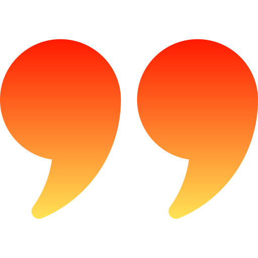

<h1 align="center">QuizMoov</h1>

<!-- Improved compatibility of back to top link: See: https://github.com/othneildrew/Best-README-Template/pull/73 -->

<!-- PROJECT SHIELDS -->
<!--
*** I'm using markdown "reference style" links for readability.
*** Reference links are enclosed in brackets [ ] instead of parentheses ( ).
*** See the bottom of this document for the declaration of the reference variables
*** for contributors-url, forks-url, etc. This is an optional, concise syntax you may use.
*** https://www.markdownguide.org/basic-syntax/#reference-style-links
-->

[![Contributors][contributors-shield]][contributors-url]
[![Forks][forks-shield]][forks-url]
[![Stargazers][stars-shield]][stars-url]
[![Issues][issues-shield]][issues-url]
[![MIT License][license-shield]][license-url]
[![LinkedIn][linkedin-shield]][linkedin-url]

<!-- PROJECT LOGO -->
 

  

  <h3 align="center">QuizMoov - test your movie knowledge.</h3>

  

    View the <a href ="https://quizmoov.netlify.app/"><strong>Live</strong> Site</a>
     
    <a href="https://github.com/mcmurray0125/quizmoov">Explore the code »</a>
     
     
    <a href="#video-demos">Video Demos</a>
    ·
    <a href="https://github.com/mcmurray0125/quizmoov/issues">Report Bug</a>
    ·
    <a href="https://github.com/mcmurray0125/quizmoov/issues">Request Feature</a>
  

<!-- TABLE OF CONTENTS -->

  
Table of Contents

  <ol>
    <li>
      <a href="#about-the-project">About The Project</a>
      <ul>
        <li><a href="#built-with">Built With</a></li>
      </ul>
    </li>
    <li>
      <a href="#view-the-live-project">View the Live Project</a>
      <ul>
      </ul>
    </li>
    <li><a href="#video-demos">Video Demos</a></li>
    <li><a href="#roadmap">Roadmap</a></li>
    <li><a href="#contributing">Contributing</a></li>
    <li><a href="#license">License</a></li>
    <li><a href="#contact">Contact</a></li>
    <li><a href="#acknowledgments">Acknowledgments</a></li>
  </ol>

<!-- ABOUT THE PROJECT -->

## About The Project

[![Product Name Screen Shot][product-screenshot]](https://github.com/mcmurray0125/quizmoov)

Welcome to QuizMoov! This web-application tests your movie knowledge by giving you a random movie quote and four multiple-choice options. See how high of a score you can get, and keep track of your results by creating an account.

_What you can do with MyMoovs:_

- Log in with Google or as a Demo User.
- Get quizzes on randomly generated movie quotes.
- Access you saved results and score.
- Use on a phone or any other device.
- See your score visualized on a bar graph created with Chart.js
- Sort your results by newest or oldest.
- Filter results by wins, losses, or all quizzes.
- View Profile summary on profile page.

_Things I learned building this project:_

- Practiced string manipulation; separated movie quotes from movie titles.
- Implemented useRef to update a state variable, then passing that state through props to change component rendering preferences.
- Bootstrap styling, focusing on develop a theme and aesthetic consistency.
- Used the Chart.js library to create responsive, interactive data visualizations.
- CSS animations in between quiz attempts (slide in, slide out).

 

Thank you for checking out QuizMoov!

(<a href="#readme-top">back to top</a>)

### Built With

 

- [![REACT][react.js]][react-url]
- [![JavaScript][javascript.com]][javascript-url]
- [![HTML5][html.org]][html-url]
- [![BOOTSTRAP][bootstrap.com]][bootstrap-url]
- [![CSS][css.org]][css-url]

(<a href="#readme-top">back to top</a>)

<!-- GETTING STARTED -->

## View The Live Project

Visit the QuizMoov web app <a href ="https://quizmoov.netlify.app/">here</a>

(<a href="#readme-top">back to top</a>)

<!-- USAGE EXAMPLES -->

## Video Demos

  
Viewing/Sorting your Results

https://user-images.githubusercontent.com/116777356/221395643-0cb53752-b7be-4997-bbc7-d51271ccb0f4.mp4

  
Taking Quizzes

https://user-images.githubusercontent.com/116777356/221395646-d884cb18-27ca-4cb6-be08-44e2bd381518.mp4

(<a href="#readme-top">back to top</a>)

<!-- ROADMAP -->

## Roadmap

- [x] Created custom design theme
- [x] Added ability to sort and filter quiz results
- [x] Responsive design
- [x] Quiz Data Visualization with Chart.js
- [ ] Connect with friends via email and see their results.

See the [open issues](https://github.com/mcmurray0125/quizmoov/issues) for a full list of proposed features (and known issues).

(<a href="#readme-top">back to top</a>)

<!-- CONTRIBUTING -->

## Contributing

Contributions are what make the open source community such an amazing place to learn, inspire, and create. Any contributions you make are **greatly appreciated**.

If you have a suggestion that would make this better, please fork the repo and create a pull request. You can also simply open an issue with the tag "enhancement".
Don't forget to give the project a star! Thanks again!

1. Fork the Project
2. Create your Feature Branch (`git checkout -b feature/amazing-feature`)
3. Commit your Changes (`git commit -m 'Add some amazing-feature'`)
4. Push to the Branch (`git push origin feature/amazing-feature`)
5. Open a Pull Request

(<a href="#readme-top">back to top</a>)

<!-- LICENSE -->

## License

Distributed under the MIT License. See `LICENSE.txt` for more information.

(<a href="#readme-top">back to top</a>)

<!-- CONTACT -->

## Contact

Michael Murray - [@LinkedIn](https://www.linkedin.com/in/michaelchristophermurray/) - mcmurray0125@gmail.com

Personal Website - [https://michael-murray.netlify.app](https://michael-murray.netlify.app)

(<a href="#readme-top">back to top</a>)

<!-- ACKNOWLEDGMENTS -->

## Acknowledgments

Here are some resources that I have found helpful:

- [Chart.js](https://www.chartjs.org/)
- [Movie-Quotes NPM Package](https://www.npmjs.com/package/movie-quotes)
- [React Bootstrap](https://react-bootstrap.github.io/)
- [Flaticon](https://www.flaticon.com/)
- [Font Awesome](https://fontawesome.com)
- [freeCodeCamp](https://www.youtube.com/@freecodecamp)
- [Img Shields](https://shields.io)

(<a href="#readme-top">back to top</a>)

<!-- MARKDOWN LINKS & IMAGES -->
<!-- https://www.markdownguide.org/basic-syntax/#reference-style-links -->

[contributors-shield]: https://img.shields.io/github/contributors/mcmurray0125/quizmoov.svg?style=for-the-badge
[contributors-url]: https://github.com/mcmurray0125/quizmoov/graphs/contributors
[forks-shield]: https://img.shields.io/github/forks/mcmurray0125/quizmoov.svg?style=for-the-badge
[forks-url]: https://github.com/mcmurray0125/quizmoov/network/members
[stars-shield]: https://img.shields.io/github/stars/mcmurray0125/quizmoov.svg?style=for-the-badge
[stars-url]: https://github.com/mcmurray0125/quizmoov/stargazers
[issues-shield]: https://img.shields.io/github/issues/mcmurray0125/quizmoov.svg?style=for-the-badge
[issues-url]: https://github.com/mcmurray0125/quizmoov/issues
[license-shield]: https://img.shields.io/github/license/mcmurray0125/quizmoov.svg?style=for-the-badge
[license-url]: https://github.com/mcmurray0125/quizmoov/blob/main/LICENSE.txt
[linkedin-shield]: https://img.shields.io/badge/-LinkedIn-black.svg?style=for-the-badge&logo=linkedin&colorB=555
[linkedin-url]: https://linkedin.com/in/michaelchristophermurray
[product-screenshot]: /public/quiz-img.png
[next.js]: https://img.shields.io/badge/next.js-000000?style=for-the-badge&logo=nextdotjs&logoColor=white
[next-url]: https://nextjs.org/
[react.js]: https://img.shields.io/badge/React-20232A?style=for-the-badge&logo=react&logoColor=61DAFB
[react-url]: https://reactjs.org/
[vue.js]: https://img.shields.io/badge/Vue.js-35495E?style=for-the-badge&logo=vuedotjs&logoColor=4FC08D
[vue-url]: https://vuejs.org/
[angular.io]: https://img.shields.io/badge/Angular-DD0031?style=for-the-badge&logo=angular&logoColor=white
[angular-url]: https://angular.io/
[svelte.dev]: https://img.shields.io/badge/Svelte-4A4A55?style=for-the-badge&logo=svelte&logoColor=FF3E00
[svelte-url]: https://svelte.dev/
[laravel.com]: https://img.shields.io/badge/Laravel-FF2D20?style=for-the-badge&logo=laravel&logoColor=white
[laravel-url]: https://laravel.com
[bootstrap.com]: https://img.shields.io/badge/Bootstrap-563D7C?style=for-the-badge&logo=bootstrap&logoColor=white
[bootstrap-url]: https://getbootstrap.com
[jquery.com]: https://img.shields.io/badge/jQuery-0769AD?style=for-the-badge&logo=jquery&logoColor=white
[jquery-url]: https://jquery.com
[javascript.com]: https://img.shields.io/badge/JavaScript-F7DF1E?logo=javascript&logoColor=000&style=for-the-badge
[javascript-url]: https://javascript.com/
[html.org]: https://img.shields.io/badge/HTML5-E34F26?logo=html5&logoColor=fff&style=for-the-badge
[html-url]: https://w3.org/html/
[css.org]: https://img.shields.io/badge/CSS3-1572B6?logo=css3&logoColor=fff&style=for-the-badge
[css-url]: https://www.w3.org/Style/CSS/Overview.en.html

<!-- This README file uses a template created by another person. View the source code of the original creator here: https://github.com/othneildrew/Best-README-Template/blob/master/LICENSE.txt -->
